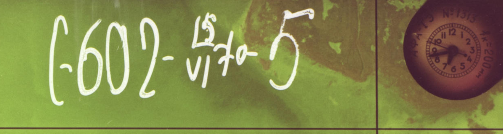
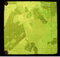
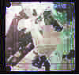

# Geo-Tag Orthophoto Labeler

A small side-project to aid the **semi-automatic geo-tagging** of scanned historical orthophotos hosted in *Maa-amet*'s **Fotoladu** service.

I first wanted to add a full disclaimer about AI-generated content, but as an LLM could not even produce a usable readme, I decided to keep only the prompt and a short warning. I have later used AI for editing purposes.

> For starters, write a basic readme for this project.
> I want to create a simple Python web application for processing images.
> The big idea is to aid the geo-tagging of archived orthophoto scans with image-labelling AI.
> Step 1 is to build a streamlined UI for tagging geographical features in the photos.
> Add a warning that a large portion of the project is AI-generated.
> Components: a Python web server that can load random images from the web service and store metadata in an SQLite database.

> **⚠️ LLM content notice**
> Large portions of this codebase, documentation, and future model pipelines are expected to be generated **with the assistance of generative-AI tools**. Please audit and test the output carefully before deploying in production.

---

## Development setup

Run `./setup_env.sh` (or `setup_env.bat` on Windows) to create a Python virtual environment and install the dependencies listed in `requirements.txt`. The scripts set up `.ortho-venv/` in the project root. Placeholder image utilities live under `src/`.

The purpose of this readme is to define the problems we are trying to solve and to outline the expected yak-shaving path.

### Glossary / background

* [Fotoladu](https://fotoladu.maaamet.ee/) - public archive of Estonian aerial photographs  
* [Fotoarhiiv](https://fotoladu.maaamet.ee/?basemap=digiaero&fotoarhiiv&overlay=tyhi) - sub-application within Fotoladu for archive of aerial photographs
* [Map-sheet numbering system (C-63)](https://geoportaal.maaamet.ee/est/ruumiandmed/kaardilehtede-susteemid/1963-a-kaardilehtede-susteem-p229.html)

## Goals

* Main – Build an experimental system that can assist geo-tagging frames on Fotoladu.
* Side – Learn a bit of computer-vision-oriented AI along the way.

Realistically, this may fail due to the considerable amount of work needed.

## Possible path of solutions and deductions

*Despite the bullet format, the list was originally not written by AI, yet.*
*I have later requested GPT to run grammar and syntax checks on this document.*

* We could improve manual image placement suggestions by showing a pin where the next image could be placed.
    Side-note - users might over-trust that pin and place the image incorrectly.
* Since the majority of images are taken sequentially from a plane using some kind of automation, we can relatively safely predict the location of the next image in the sequence. The gap between two consecutive images is usually 3-5 km.
    Side-note - old orthophotos include a clock in some corner. Given three images with timestamps and two with positioning, this allows us to roughly estimate distance between image sequences even when images are not in immediate vicinity. See images [272268](https://fotoladu.maaamet.ee/arhiiv=272268) and [272267](https://fotoladu.maaamet.ee/arhiiv=272267) as a great counterexample. Two images were digitised one after another, but were originally taken 44 frames apart, one at 18:42:48, the other at 19:07:23
  
* About 99.99% of images are consistently oriented correctly north-up. Image 272268 (a.k.a the 5th image of flight C-602) above is a counterexample that prompted formalising this project.
* We could estimate image locations even more accurately by comparing two images and detecting overlapping parts. This step is eased because usually images are taken sequentially and therefore the matching algorithm already knows which image is likely the closest match to the observed one.
* That method may cause a risk of drifting difference between old imagery and new modern background imagery, especially when using the historic background layer which may have incorrect georeference on its own.
* We might be able to rely on relatively fixed features such as old farmhouses, major railways, distinctively shaped land plots (see image 272268 above).
* Since every image may not have such a key feature, it could be wise to attempt to stitch together individual frames and then georeference features far away from each other and interpolate the result to the entire stitching.
* They already have a [dedicated layer group](https://fotoladu.maaamet.ee/?basemap=digiaero&minimap=1983%20Maa-amet&zlevel=11,24.50177,58.38413&fotoarhiiv&overlay=1983) in the Fotoladu application where they have already done this.
    For some reason, images that were used for stitching were not georeferenced, even though somewhere in their system there has to be information on individual frame positions.
* It's highly likely that the Land Board already has working AI solutions for this exact purpose. On the other hand, scanning 50-year-old archive footage probably has low priority and is therefore less likely to be developed.

*P.S. I have not yet contacted the Land and Spatial Development Board, so the project might be obsolete before this readme is even started.*

## Bring in the AI

* This leads us to the conclusion that after positioning the first few images, it's relatively easy to position new images.
* Therefore, the biggest challenge is knowing where or how to place the first few images of a flight's sequence.
* Those images do not necessarily have to be the first images of a flight, as one could also traverse the array in reverse (although the current Fotoladu application does not allow this).
* If we can position any image in an uninterrupted sequence, then every other image can be positioned too.
* Every\* photo has a standard marking consisting of a flight number, date and sequence number.
  \* Excluding a few special series from other sources, such as WW2-era German reconnaissance flights.
* Flight number is already somehow linked to the old map sheet numbering scheme, most often the [C-63 system](https://geoportaal.maaamet.ee/est/ruumiandmed/kaardilehtede-susteemid/1963-a-kaardilehtede-susteem-p229.html).
* Sheet number is neither a reliable nor an accurate way to locate images. Judging by data, it seems that the sheet number is determined by the (temporary) location of an individual photo or flight, or vice versa. When an image has not been georeferenced, it is shown to be located somewhere on the sheet, but likely nowhere near its actual location.
  * Apparently, the default location of an image is the integer value of the WGS84 coordinates at which it is located (e.g. 59.0, 24.0).
  * No idea where those coordinates came from.
* A single flight can encompass multiple map sheets.
* Man-made features tend to have been built using straight lines, making them easier to spot on images.
* As mentioned earlier, the most likely places that could be located are man-made features that have stood there for decades or centuries, such as railways or farmhouses.
* Even better, if we have a cluster of buildings - also known as a town or village.
* Therefore, we should focus on detecting images that have not been geolocated but likely contain human settlements.
* Sounds like a great task for computer-vision-based AI.
* After AI has detected settlements, we could assess their relative size (the percentage of the image containing settlement) and then try to match the shape or road network with modern known urban street networks.
* We could then use conventional image-stitching techniques combined with sequence-induced optimizations to build the rest of the images around pinpointed urban imagery.
* Second branch of inquiry could be to use object-detection AI for reading metadata from the image - locating the image number and analogue clock and reading their values.
* In theory, this should be a super-easy and standardised problem to solve. I'm worried my laptop is very likely unable to train even a single-layer CNN for a single epoch to try it out.
* That's why this project ought to include some conventional OpenCV2-based signal processing too.

### Solution

* In order to develop AI, we need to train a model. As mentioned above, I don't have the resources to properly train one.
* However, I could create a labelling tool.
  * Well, there's an abundance of possible tagging software; the challenge is determining which ones are free, could potentially be locally hosted and, most importantly, are for tagging whole images, not annotating objects in images.
* As I don't want to download images to a local PC, and to future-proof tagging data for potential integration with the official Fotoladu, I could use a SQLite local DB to store image metadata and/or tagging information about images.
* Fotoladu doesn't have much of an API. For downloading images, I could use image search results.
* Most diverse results can be queried by searching images by individual frame number, using a 3-digit integer as the search term.
    E.g GET <https://fotoladu.maaamet.ee/otsing_arhiiv.php?foto_nr=432&aasta=&kaardileht=&lennu_nr=&foto_tyyp=&allikas=&sailiku_nr=&w=611.4&h=739.2&start=0&lkcount=10>
* Despite `lkcount=10` parameter, this link returns an HTML page containing 30 image URLs. Images are 'reduced', 512 px along the longer edge, usually around 40-50 kB. Image URLs are contained within `` tags; therefore I'll need regex there.
* Speaking of preprocessing, an equalising filter and a high-pass filter should probably be applied before training.
* The biggest problem with image search is that it may already include georeferenced images.
* Due to the number of images, it might be worth investigating whether there are other API endpoints for querying image metadata.

### Technical

Estonia uses the EPSG:3301 projection, which is an XY system measuring metres from the equator and the meridian.
Fotoladu images are not perfect squares, but typical image usually has both sides around 490-530 px.
For starters, it might be easier to use whole-image labelling AI and later specialise into keypoint detection or image segmentation.

Before directing to AI training, it might be a good idea to standardise image colours.
In theory, equalising each channel of the NIR image may restore the original colours. However, in the case of black-and-white images, we should instead try to tweak the light balance to achieve an image's mean pixel brightness of 50%. Since most (but not all) images contain either pure black or pure white border pixels, we should exclude them from equalisation, perhaps using bottom-12 and top-3 thresholds. This thresholding won't work if an image is too dark. Perhaps tweaking light balance should still be the first step.

All this was for near-infrared colour images, but what about monochrome B/W images? I can't think of anything more than the same brightness-balance tweak as with individual colour channels. Assuming that the camera had the same settings during the flight, we should run calculations on the average of the entire batch, because otherwise flights over areas with different albedo (such as fields versus sea) will show the same object significantly in different tones.

Basically, the objective of thresholding is to detect and remove image frames. Maybe there's a better way to crop off the borders of film scans?

We could assume same film roll has consistent colour distortion over entire flight/roll?
Maybe the first step is to colour-correct all images in a single batch by calculating their average vignette and then somehow correct them. Also, apply blur before averaging.
Image equalisation won't work when dealing with images with very limited luminosity range, such as [pictures of sea](https://fotoladu.maaamet.ee/data/archive/arhiiv/ma_neg_ngr/324-C-413-68/reduced/1968-C413-614.jpg).

 

(AI snippet)
The first milestone is a streamlined UI that lets archivists and volunteers quickly tag geographical features (roads, rivers, building footprints, land-use areas, etc.) in raster imagery. In later phases, those human-confirmed tags will be used to train and fine-tune image-labelling models that can auto-suggest tags for new, unseen scans.

#### AI generated summary of image processing notes

I asked for input on how to approach image processing, and since it pointed out some alleged best practices and OpenCV2 features, requested a summary suitable for later use as input for coding.

**First-pass normalisation steps for Fotoladu frames.**
We are assuming we deal with a medium image size of 512 px.

#### 0 · Decide if the frame is colour or B/W

*Goal - route each frame to the correct branch without external metadata.*

* **Quick heuristic** - sample a 128 x 128 px patch dead-centre.  
  *If* `std(R-G) + std(G-B) < 5% of total luma std` -> probably B/W.
  *Small colour casts from ageing film still trigger the colour path; that is acceptable.*
* **Fallback** - if the three **digital-number** (DN) histograms have >= 95% of their mass inside the same 10-DN bin (e.g. 120-129), treat as B/W.  
  DN = the raw 8-bit scanner value 0...255.
* **Log the decision** - write a flag into SQLite (`is_color = 0/1`) for reproducibility.

#### 1 · Common pre-steps (both B/W & colour)

* **Crop borders early** - *How* -> look in the grey image and threshold out very dark or very bright pixels, then:

  1. **Flood-fill** - start at (0, 0) and grow into every neighbour that passes the threshold; this finds the connected border blob (scanner platen, black tape, etc.).
  2. **Dilate by 8 px** - morphological dilation (Photoshop's *Maximum filter*) expands that blob eight pixels inward; this margin ensures later stats never sample ragged border leftovers.
  3. Invert the mask, take its bounding box, crop the photo.

  Code snippet for illustrating the algorithm:

  ```python
  g = cv2.cvtColor(img, cv2.COLOR_BGR2GRAY)
  _, m = cv2.threshold(g, 8, 255, cv2.THRESH_BINARY_INV)      # 8 ≈ noise floor
  m = cv2.floodFill(m, None, (0, 0), 255)[1]                  # step 1
  m = cv2.dilate(m, np.ones((8, 8), np.uint8))                # step 2
  x, y, w, h = cv2.boundingRect(255 - m)                      # step 3
  cropped = img[y:y+h, x:x+w]
  ```

* **Vignette (illumination) correction**

  1. Down-sample to 512 px width.
  2. Blur with a *very* wide Gaussian (σ \~120 px).
  3. Divide the full-res image by the up-scaled blur field, then rescale to 0-255.
     *Corners end up within ±5% of centre brightness on >90% of flights.*

* **Per-frame metrics** (for QC SQL queries later) - Compute `mean, std, p2, p98` of **luma** and insert into table `frame_stats`.
  * luma = `0.299 R + 0.587 G + 0.114 B`, i.e. perceptual brightness.

#### 2 · Branch A - B/W (panchromatic) frames

Panchromatic = one grey channel that covered the entire visible spectrum in film stock; still "monochrome", but not tied to a single colour band.

* **Global percentile stretch** - use flight-wide \<p2, p98>; `dst = (src-p2)/(p98-p2)` -> uniform contrast across the roll.
* **Conditional CLAHE** - **C**ontrast-**L**imited **A**daptive **H**istogram **E**qualisation (`tile = 64x64, clip = 2`). Run only if `std(luma) < 30` **after** the stretch (handles dull, low-contrast scans).
* **Optional unsharp display copy** - 1.2 px radius, 0.7 weight; store separately, never feed to ML.

#### 3 · Branch B - NIR false-colour (CIR) frames

*Objective: recover a *clean* vintage CIR palette - magenta vegetation, cyan water - by neutralising age-induced yellow/orange bias, **not** by faking natural RGB.*

1. **Channel alignment** - register **G->R** and **NIR->R** via phase correlation (max ± 4 px) to remove purple fringes.
2. **Black-point subtraction** - subtract each channel's 1-percentile DN (scanner dark current).
3. **Grey-World gain balance** - per channel: `gain_c = mean(all) / mean(c)`; multiply & clip -> a neutral grey baseline.
4. **Per-flight 3-band LUT** - map each channel's cumulative histogram to that of the best-looking frame in the same flight; apply with `cv2.LUT` -> consistent colour across the strip.
5. **Outputs**

   * `roll_CIR_master.tif` - 3-band, radiometrically honest, EPSG 3301.
   * `roll_CIR_display.jpg` - 80% JPEG for the web UI (same colours, smaller size).

(QA hint - quick NDVI on a pine stand: if healthy conifers are positive and water is near zero, colour correction is "good enough".)

#### 4 · Post-steps (both branches)

* **Tiny median filter** - 1 px window; replace any isolated 0 or 255 "salt-and-pepper" pixel with the neighbourhood median.
* **Update DB** - mark `processed = 1`, store `path_master`, `path_display`, timestamp.

#### Notes & constants

* All thresholds are percentile-based; we never assume the scan contains "pure" white or black patches.
* Vignette blur (σ \~120 px) is tuned for 1920-px scans; scale proportional to long edge.
* For the 0.1% of severely under-exposed B/W frames, consider log-domain equalisation instead of linear.
* Future idea - auto-flag frames whose NDVI < 0 over evergreen forests (likely misaligned channels).

---

#### Maa-amet Fotoladu API endpoints

* GET <https://fotoladu.maaamet.ee/otsing_arhiiv.php?foto_nr=532&aasta=&kaardileht=&lennu_nr=&foto_tyyp=&allikas=&sailiku_nr=&w=611.4&h=739.2&start=0&lkcount=10> – returns a list of image URLs plus basic metadata and overall search results counter.
* GET <https://fotoladu.maaamet.ee/paring_closest_arhiiv.php?B=59&L=24&lahimad=&id=261295&leier=1963> - returns nearby georeferenced images.
* GET
 <https://fotoladu.maaamet.ee/otsing_arhiiv.php?foto_nr=615&aasta=&kaardileht=O3550A&lennu_nr=&foto_tyyp=&allikas=&sailiku_nr=&w=727.4&h=739.2&start=0&lkcount=10> – Another sample URL.

Fotoladu pulls frame metadata with a bounding-box call such as
`paring_db_arhiiv.php?aasta=1978&a_lat=58.676&a_lng=27.107&u_lat=58.725&u_lng=27.209&m=9&arhiiv`.
That query is triggered inside **`pildibaas()`**, which the image grid calls whenever the map moves, zooms, or a year is selected.  The response is GeoJSON: every feature bundles the frame ID, pixel size, directory parts and a **tapsus** flag that marks positional accuracy (0 = rough, 1 = unknown, 2 = exact, 3 = user-set).  When a thumbnail is clicked, the inline `onclick` fires **`kuvapiltfuncarhiiv(...)`**, hiding the search pane, re-issuing `pildibaas()` for that year (to keep the cluster layer in sync) and, finally, opening a Leaflet popup at the supplied latitude and longitude.

`kuvapiltfuncarhiiv(id, aasta, B, L, tapsus, w, h, peakaust, kaust, fail, lend, fotonr, kaardileht, tyyp, allikas)` passes all the fields your scraper needs to reinterpret the GeoJSON later: the internal **frame ID** (`id`), **year**, **lat/lon** (`B`, `L`), **tapsus** accuracy flag, **image size** (`w`, `h`), **storage paths** (`peakaust`, `kaust`, `fail`), **flight number** (`lend`), **sequential photo number** (`fotonr`), **map-sheet code** (`kaardileht`), **photo type** (`tyyp`; 0=contact B/W, 1=contact false-colour, 3=negative, 4=photoplane) and **source** (`allikas`).  In other words, the function arguments are a clean, positional mapping of the same attributes that appear as `idnr`, `w`, `h`, `tapsus`, `peakaust`, `kaust`, `fail`, etc. in the `paring_db_arhiiv.php` payload—handy for building an offline metadata table.

**Useful endpoints at a glance**  
URL's in table contain zero-width spaces `​` for typesetting.

| Purpose | Example call | Notes |
| -------- | -------- | -------- |
| Search by frame number | `otsing_arhiiv.php?​foto_nr=532&lkcount=10` | Returns an HTML page; scrape `` tags for URLs. |
| Bounding-​box query (archive) | `paring_db_arhiiv.php?​aasta=1963&​a_lat=59.00&​a_lng=24.00​&u_lat=59.10​&u_lng=24.20&​m=9&​arhiiv` | GeoJSON with `idnr`, `w`, `h`, `tapsus`, etc. |
| Bounding-box query (modern)  | `paring_db_cluster.php?​l=2019&​a_lat=...` | Same structure, field names slightly different. |
| Nearest images | `paring_closest_arhiiv.php?​B=59&​L=24&​id=261295&​leier=1963` | Five closest georeferenced frames. |

**Image file variants**  

* <https://fotoladu.maaamet.ee/data/archive/arhiiv/ka_ngr/1983_L964_O35_25/thumbs/1983-L964-426.jpg> (100x100 px)
* <https://fotoladu.maaamet.ee/data/archive/arhiiv/ka_ngr/1983_L964_O35_25/reduced/1983-L964-426.jpg> (512x512 px)
* <https://fotoladu.maaamet.ee/data/archive/arhiiv/ka_ngr/1983_L964_O35_25/hd/1983-L964-426.jpg> (1920x1920 px)
* 

## License

[GPL or MIT](LICENSE) (will be subject to change.)

---

*Happy mapping!*

Prompt to fix spelling errors (prompt itself is AI-genereated, and then amended)
> Please make only the smallest necessary edits to my readme notes. Preserve the original wording wherever possible—only adjust word order or sentence order when absolutely needed. Correct any grammar, syntax, punctuation, and missing or incorrect articles. Finally, perform a brief fact‐check to ensure there are no contradictions between chapters. Use only basic keyboard characters (e.g., straight quotes ", hyphens -, and arrows ->) rather than any fancy typography. Preserve existing formatting (bold, italic) where appropriate. Prefer British English over American.
